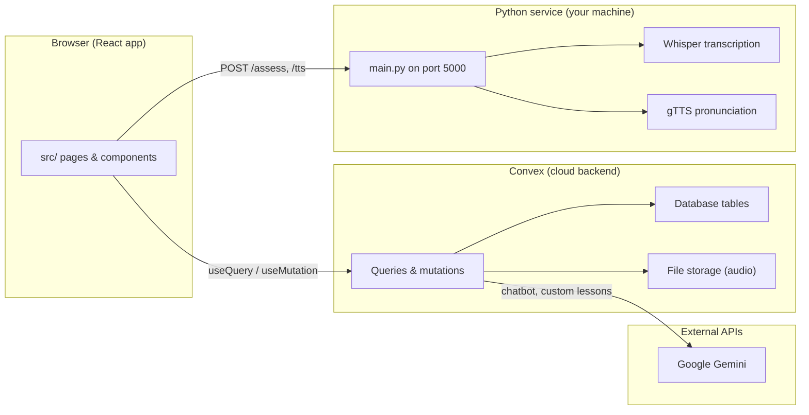
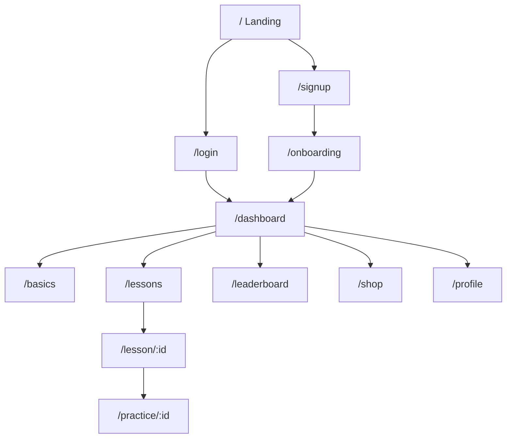
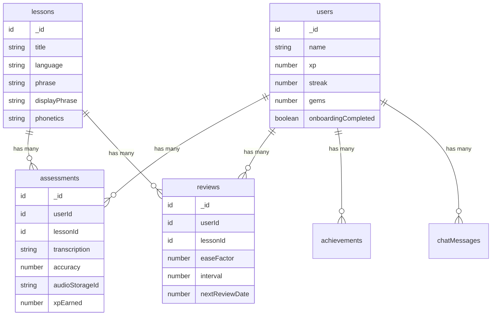
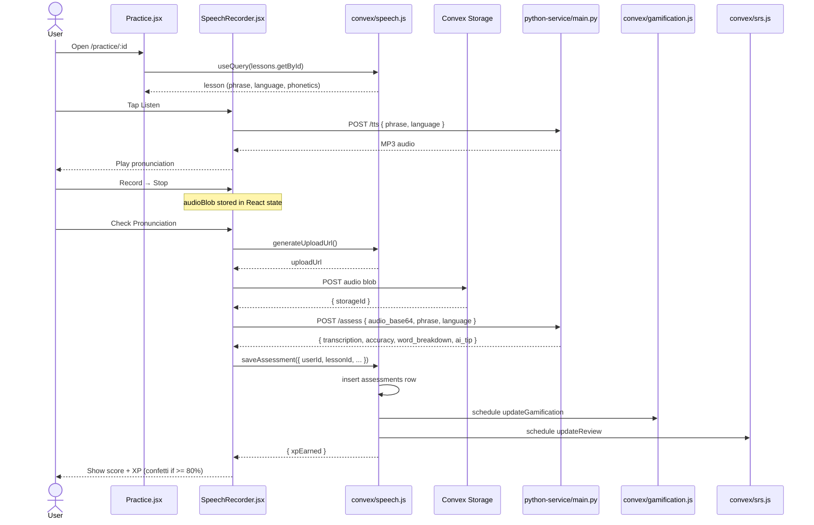
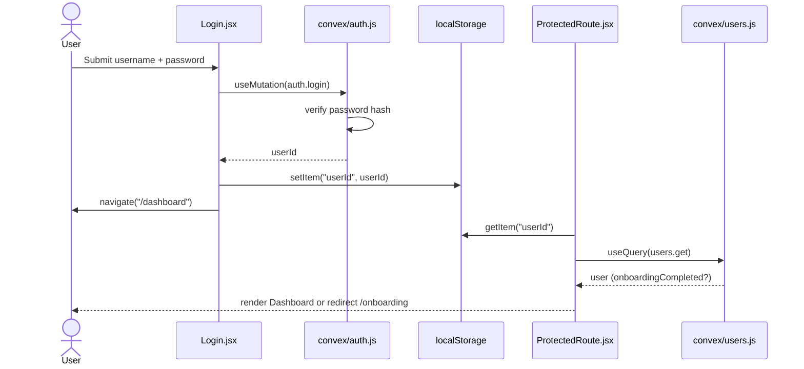
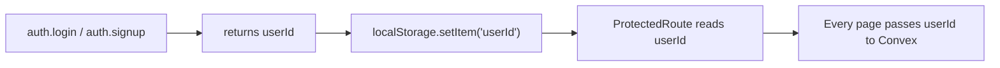

# LangBridge — First-Day Onboarding

Welcome to the team. This guide uses the **actual** folders and names in this repo so you can orient yourself quickly.

---

## 1. What does this app actually do?

Imagine Duolingo, but focused on **South Indian languages** — Kannada, Tamil, Telugu, Malayalam, Tulu, and Kodava.

A learner opens LangBridge, picks a language, and works through short lessons like “say hello” or “thank you.” They can **hear** the correct pronunciation, **record themselves**, and get a **score** on how close they were. The app turns that into a game: XP, daily streaks, gems, a shop, a leaderboard, and daily quests.

There is also a floating **AI tutor** (named EnZo in the code) they can chat with about grammar, vocabulary, and culture.

**In one sentence:** LangBridge is a gamified language-learning app that listens to your voice, scores your pronunciation, and tracks your progress over time.

### Supported languages

| Language  | Script / notes                          |
|-----------|-----------------------------------------|
| Kannada   | Primary curriculum language             |
| Tamil     | Full lesson path                        |
| Telugu    | Full lesson path                        |
| Malayalam | Full lesson path                        |
| Tulu      | Uses Kannada script; TTS maps to `kn`   |
| Kodava    | Uses Kannada script; TTS maps to `kn`   |

---

## 2. The big pieces (who does what)

Think of the system as four cooperating services:

### Architecture overview



### Tech stack

| Layer          | Technologies                                              |
|----------------|-----------------------------------------------------------|
| Frontend       | React 19, Vite, React Router, Tailwind CSS, Framer Motion, Chart.js |
| Backend        | Convex (database, real-time sync, server functions)       |
| Speech service | Python, Flask, faster-whisper, gTTS                       |
| AI             | Google Gemini (`@google/genai`)                           |

### Major components

| Piece | Location | Job |
|--------|-----------|-----|
| **Frontend** | `src/` | Everything the user sees and clicks. React 19 + Vite + React Router + Tailwind. Pages live in `src/pages/`, reusable UI in `src/components/`. |
| **Convex backend** | `convex/` | Database, business logic, real-time sync, and audio file storage. When the frontend calls `useQuery` or `useMutation`, it talks to functions here. |
| **Python speech service** | `python-service/` | Runs locally on `http://localhost:5000`. Transcribes voice (Whisper) and scores pronunciation. Also generates “listen” audio via text-to-speech. |
| **Google Gemini** | Convex env var `GEMINI_API_KEY` | Powers the AI chatbot (`convex/chatbot.js`) and custom lesson generation (`convex/ai.js`). Optional in Python for pronunciation tips. |

### Project folder structure

```
lang123/
├── src/                  # React frontend
│   ├── pages/            # Route pages (Dashboard, Lessons, Practice, etc.)
│   ├── components/       # UI, speech, gamification, chat widgets
│   └── lib/              # Convex client setup
├── convex/               # Convex backend functions & schema
│   ├── schema.js         # Database tables (users, lessons, assessments, …)
│   ├── auth.js           # Signup / login
│   ├── speech.js         # Audio upload & assessment storage
│   ├── gamification.js   # XP, streaks, achievements
│   ├── srs.js            # Spaced repetition scheduling
│   ├── chatbot.js        # RAG-powered AI tutor
│   └── ai.js             # Custom lesson generation
└── python-service/       # Local speech API (port 5000)
    ├── main.py           # /assess and /tts endpoints
    ├── whisper_service.py
    └── pronunciation.py
```

### Frontend map (high level)

| Folder / file | Role |
|---------------|------|
| `src/main.jsx` | App entry — wraps everything in `ConvexProvider` |
| `src/App.jsx` | All routes (`/dashboard`, `/lessons`, `/practice/:id`, etc.) |
| `src/lib/convex.js` | Connects React to your Convex deployment |
| `src/pages/` | One file per screen (Dashboard, Lessons, Practice, Shop, …) |
| `src/components/speech/` | Microphone recording, TTS listen button, feedback UI |
| `src/components/gamification/` | XP, quests, achievements |
| `src/components/chat/` | Floating AI tutor widget |
| `src/components/ProtectedRoute.jsx` | Guards routes; checks `localStorage` + onboarding status |

### App routes



| Route | Page file | Protected? |
|-------|-----------|------------|
| `/` | `src/pages/Landing.jsx` | No |
| `/login` | `src/pages/Login.jsx` | No |
| `/signup` | `src/pages/Signup.jsx` | No |
| `/onboarding` | `src/pages/Onboarding.jsx` | Yes |
| `/dashboard` | `src/pages/Dashboard.jsx` | Yes |
| `/lessons` | `src/pages/Lessons.jsx` | Yes |
| `/lesson/:id` | `src/pages/LessonDetail.jsx` | Yes |
| `/practice/:id` | `src/pages/Practice.jsx` | Yes |
| `/leaderboard` | `src/pages/Leaderboard.jsx` | Yes |
| `/shop` | `src/pages/Shop.jsx` | Yes |
| `/profile` | `src/pages/Profile.jsx` | Yes |
| `/basics` | `src/pages/Basics.jsx` | Yes |

### Backend map (high level)

| File | Role |
|------|------|
| `convex/schema.js` | **The database blueprint** — all tables and indexes |
| `convex/auth.js` | Signup / login |
| `convex/speech.js` | Audio upload URLs + saving pronunciation results |
| `convex/gamification.js` | XP, streaks, gems, achievements |
| `convex/srs.js` | Spaced repetition scheduling (when to review a lesson again) |
| `convex/lessons.js` | Fetching and creating lessons |
| `convex/chatbot.js` | RAG-powered AI tutor |
| `convex/users.js`, `shop.js`, `quests.js`, `progress.js` | Profile, shop, quests, progress stats |
| `convex/knowledgeBase.js` | Context retrieval for the chatbot (RAG) |
| `convex/seedLessons.js` | Seeds lesson data into the database |

### Database entity relationships



---

## 3. Data flow — one real user action

**Scenario:** User practices pronunciation on the Practice page.

This is the most interesting path because it touches **every** major piece.

### Sequence diagram — pronunciation check



### Step-by-step

**① User navigates to a lesson**

- URL: `/practice/:id` (defined in `src/App.jsx`)
- `src/pages/Practice.jsx` reads the lesson ID from the URL
- It calls `useQuery(api.lessons.getById, { id })` → Convex fetches from the `lessons` table

**② User sees the phrase and taps “Listen”**

- `SpeechRecorder.jsx` renders `ListenButton.jsx`
- `ListenButton` sends `POST http://localhost:5000/tts` with `{ phrase, language }`
- Python (`python-service/main.py`) uses gTTS and returns an MP3
- Browser plays the audio

**③ User taps Record → Stop**

- Browser `MediaRecorder` captures microphone audio as a `.webm` blob
- Nothing hits the server yet — it stays in React state

**④ User taps “Check Pronunciation”**

This is where the real pipeline runs, in `SpeechRecorder.jsx` → `submit()`:

1. **Convert audio to base64** (for the Python service)
2. **Upload raw audio to Convex storage**
   - `generateUploadUrl()` mutation in `convex/speech.js`
   - `fetch(uploadUrl, { body: audioBlob })` → returns `{ storageId }`
3. **Send audio to Python for scoring**
   - `POST http://localhost:5000/assess` with:
     ```json
     { "audio_base64": "...", "phrase": "...", "phonetics": "...", "language": "Kannada" }
     ```
   - Python transcribes with Whisper, compares to expected phrase in `pronunciation.py`
   - Returns:
     ```json
     { "transcription": "...", "accuracy": 87, "word_breakdown": [...], "ai_tip": "..." }
     ```
4. **Save results in Convex**
   - `saveAssessment()` mutation in `convex/speech.js` inserts into `assessments` table
   - Schedules two background jobs:
     - `internal.gamification.updateGamification` → updates XP, streak, gems
     - `internal.srs.updateReview` → schedules next review date
5. **Show feedback on screen**
   - If `accuracy >= 80`: confetti, XP earned, “Continue” button
   - If below 80: “Try again”

**⑤ Dashboard updates automatically**

- Because Convex is real-time, any page using `useQuery(api.users.get, …)` will reflect new XP/streak without a manual refresh

### Visual summary (ASCII)

```
[Practice page]
     │
     ├─ useQuery ──► convex/lessons.js ──► lessons table
     │
     ├─ ListenButton ──► localhost:5000/tts ──► MP3 audio
     │
     └─ submit()
           ├─ generateUploadUrl ──► Convex file storage
           ├─ localhost:5000/assess ──► Whisper + scoring
           └─ saveAssessment ──► assessments table
                                    ├─ gamification (XP, streak, gems)
                                    └─ srs (next review date)
```

### Bonus: login flow (simpler path)



---

## 4. The contracts — shapes you must not break

These are the “agreements” between parts of the system. Change them without updating every caller and things silently break.

### A. Database schema (`convex/schema.js`)

Every table field is typed with Convex validators (`v.string()`, `v.number()`, etc.). The main tables:

| Table | What it stores | Key fields |
|-------|----------------|------------|
| `users` | Account + gamification state | `name`, `passwordHash`, `xp`, `streak`, `gems`, `onboardingCompleted` |
| `lessons` | Phrases to learn | `title`, `language`, `phrase`, `displayPhrase`, `phonetics`, `order`, `unit` |
| `assessments` | Each pronunciation attempt | `userId`, `lessonId`, `transcription`, `accuracy`, `audioStorageId`, `xpEarned` |
| `reviews` | Spaced repetition schedule | `userId`, `lessonId`, `easeFactor`, `interval`, `nextReviewDate` |
| `achievements` | Unlocked badges | `userId`, `name`, `description`, `unlockedAt` |
| `chatMessages` | AI tutor history | `userId`, `role` (`"user"` \| `"assistant"`), `content`, `language` |

**Rule:** If you add/rename/remove a field in `schema.js`, you must update every function that reads or writes that field.

### B. Convex function signatures

Every exported function declares `args` with validators. Examples:

```javascript
// convex/auth.js
login({ name: string, password: string }) → userId

// convex/speech.js
saveAssessment({ userId, lessonId, transcription, accuracy, audioStorageId }) → { xpEarned }

// convex/chatbot.js
chat({ userId, message, language }) → assistant reply string
```

The frontend imports these via the auto-generated `convex/_generated/api` — **never edit `_generated/` by hand**.

### C. Python Flask API contracts

**`POST /assess`** — request:

```json
{ "audio_base64": "...", "phrase": "...", "language": "kannada", "phonetics": "..." }
```

Response:

```json
{
  "transcription": "...",
  "accuracy": 85,
  "word_breakdown": [
    {
      "word": "...",
      "status": "correct",
      "spoken_as": "..."
    }
  ],
  "ai_tip": "..."
}
```

`word_breakdown[].status` must be one of: `"correct"` | `"mispronounced"` | `"missing"`

**`POST /tts`** — request:

```json
{ "phrase": "...", "language": "Kannada" }
```

Response: raw MP3 bytes (`audio/mpeg`)

The frontend hardcodes `http://localhost:5000` in `SpeechRecorder.jsx` and `ListenButton.jsx`. If the port or path changes, both must change.

### D. Frontend ↔ backend auth contract

There is **no JWT or session cookie**. The pattern is:



1. `auth.login` / `auth.signup` returns a Convex document ID
2. Frontend stores it: `localStorage.setItem('userId', userId)`
3. `ProtectedRoute.jsx` reads `localStorage.getItem('userId')` and passes it to every protected query/mutation

Every protected page assumes `userId` is a valid `v.id("users")`.

### E. Language name convention

Lessons store language as strings like `"Kannada"`, `"Tamil"`. Python maps them to ISO codes in `LANGUAGE_CODES` in `main.py`:

| Language string | Python TTS/Whisper code |
|-----------------|-------------------------|
| kannada         | `kn`                    |
| tamil           | `ta`                    |
| telugu          | `te`                    |
| malayalam       | `ml`                    |
| tulu            | `kn` (Kannada script)   |
| kodava          | `kn` (Kannada script)   |

Mixing `"kannada"` vs `"Kannada"` can break filtering or TTS.

---

## 5. Where the risky parts are

| Risk area | Why a beginner can break it |
|-----------|----------------------------|
| **`convex/schema.js`** | Adding a required field without defaults breaks existing rows and every insert. Removing a field breaks queries that still reference it. |
| **Convex validators (`args`)** | Frontend sends `{ userId, lessonId }` — if you rename an arg in the backend, the frontend call fails at runtime with a validation error. |
| **`convex/_generated/`** | Auto-generated by `npx convex dev`. Editing these files gets overwritten and causes type mismatches. |
| **Hardcoded `localhost:5000`** | Practice and TTS fail silently (or with alerts) if the Python service is not running. Easy to forget in dev setup. |
| **`localStorage` auth** | Not secure — anyone can paste a user ID. Fine for a student project; do not treat it as production auth. |
| **Scheduled internal mutations** | `speech.saveAssessment` triggers `internal.gamification.updateGamification` and `internal.srs.updateReview`. Changing one without the other desyncs XP from review schedules. |
| **`GEMINI_API_KEY`** | Chatbot and custom lessons fail if missing from Convex environment. Python pronunciation tips also need a Gemini key locally. |
| **Language string casing** | `"Kannada"` vs `"kannada"` — inconsistent casing breaks indexes, filters, and TTS mapping. |
| **Whisper first-run download** | First Python startup downloads a large model. Looks like a hang; not a code bug. |

---

## 6. Where to start reading code

### Recommended reading order

1. **`README.md`** — setup and how to run all three services
2. **`src/App.jsx`** — see every route in one place
3. **`convex/schema.js`** — understand what data exists
4. **`src/pages/Practice.jsx`** + **`src/components/speech/SpeechRecorder.jsx`** — the flagship feature end-to-end
5. **`convex/speech.js`** — the backend half of that same flow

### Smallest safe first task

**Change copy on the Practice page** — zero backend risk.

Open `src/pages/Practice.jsx` and edit the heading or subtitle (lines 44–49):

```jsx
<h1 style={{ fontSize: 28, fontWeight: 800, ... }}>
  Translate this sentence
</h1>
<p style={{ color: 'var(--text-secondary)', fontSize: 15, margin: 0 }}>
  Listen, repeat, and get scored on your pronunciation.
</p>
```

Run `npm run dev`, visit `/practice/<some-lesson-id>`, and confirm your text appears.

### Slightly bigger but still safe

**Add a new daily goal option on Profile** — touches one mutation that already exists:

- Read `convex/users.js` → `updateDailyGoal`
- Find where Profile calls it in `src/pages/Profile.jsx`
- Add a new button value (e.g. 100 XP)

The contract is already defined; you are only changing UI choices.

### What to avoid on day one

- Do not edit `convex/schema.js` yet
- Do not rename Convex function arguments
- Do not change the `/assess` response shape without updating `SpeechRecorder.jsx`
- Do not commit `.env.local` or API keys

---

## Running the full stack locally

You need **three terminals**:

| Terminal | Command | What it runs |
|----------|---------|--------------|
| 1 | `npx convex dev` | Convex backend + sync |
| 2 | `cd python-service && python main.py` | Speech service on port 5000 |
| 3 | `npm run dev` | React frontend (usually port 5173) |

Optional: seed lessons with `npx convex run seedLessons:seed`.

### Environment variables

| Variable | Where | Description |
|----------|-------|-------------|
| `VITE_CONVEX_URL` | `.env.local` (auto-generated) | Convex deployment URL for the React client |
| `GEMINI_API_KEY` | Convex environment | Google Gemini API key for chatbot & custom lessons |

### Dev startup diagram

```
┌─────────────────────────────────────────────────────────────┐
│                     YOUR MACHINE                            │
│                                                             │
│  Terminal 1          Terminal 2           Terminal 3        │
│  npx convex dev      python main.py       npm run dev       │
│       │                    │                    │           │
│       ▼                    ▼                    ▼           │
│  Convex Cloud        localhost:5000      localhost:5173     │
│  (DB + functions)    (Whisper + TTS)     (React UI)         │
│       ▲                    ▲                    │           │
│       └────────────────────┴────────────────────┘           │
│              Frontend talks to both services                │
└─────────────────────────────────────────────────────────────┘
```

---

## Mental model to keep in your head

```
User clicks something in src/pages/ or src/components/
        ↓
React hook (useQuery / useMutation / fetch)
        ↓
Either Convex function (convex/*.js)  OR  Python (python-service/)
        ↓
Database table / file storage / AI API
        ↓
Response flows back → React re-renders (Convex updates are live)
```

LangBridge is **not** a classic “Express API + PostgreSQL” app. Convex functions *are* the API, and the database reacts in real time. The Python service is a separate sidecar used only for speech.

---

## Quick reference card

```
┌──────────────────┬────────────────────────────────────────────┐
│ I want to…       │ Start here                                 │
├──────────────────┼────────────────────────────────────────────┤
│ Change a page UI │ src/pages/<PageName>.jsx                   │
│ Change a route   │ src/App.jsx                                │
│ Add DB field     │ convex/schema.js (+ all readers/writers)   │
│ Fix pronunciation│ SpeechRecorder.jsx + python-service/       │
│ Fix XP/streaks   │ convex/gamification.js                     │
│ Fix AI tutor     │ convex/chatbot.js + GEMINI_API_KEY         │
│ Seed lessons     │ npx convex run seedLessons:seed            │
└──────────────────┴────────────────────────────────────────────┘
```
